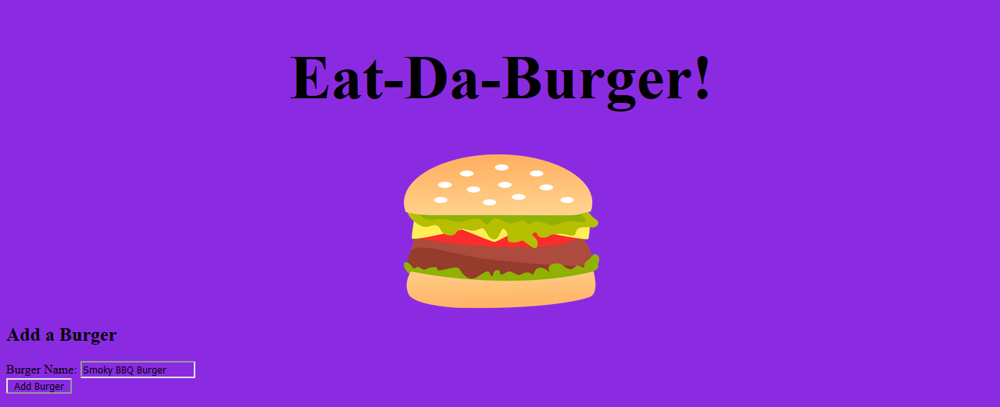
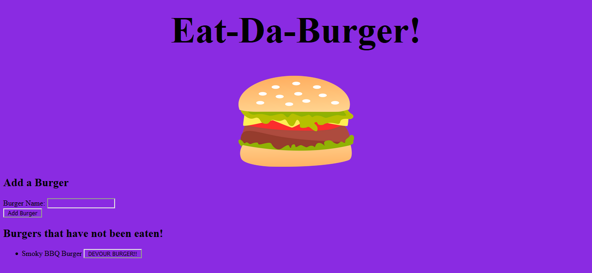

# Eat-Da-Burger

## About

Eat-da-burger is a simple app meant to help users keep track of any delicious burgers that they would like to keep track of. The list lets the user add burgers, and burgers that added have a button that allows the user to remember whether they have eaten that particular burger before. When the button is clicked, 

## Screenshots

## Technology

- NodeJS
- Express
- Handlebars

## Links

- https://eatdaburger-nk.herokuapp.com/
- https://github.com/marauder30/burger

## Author

[Nicholas Koch](https://marauder30.github.io/portfolio)