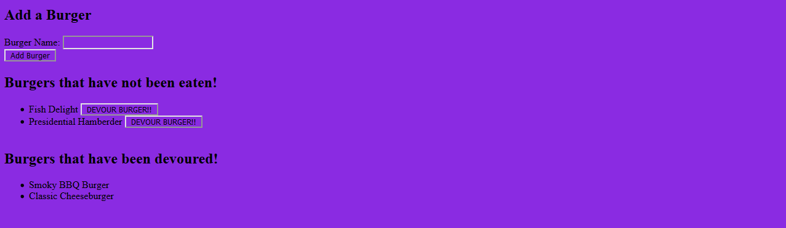

# Eat-Da-Burger

## About

Eat-da-burger is a simple app meant to help users keep track of any delicious burgers that they would like to keep track of. The list lets the user add burgers, and burgers that added have a button that allows the user to remember whether they have eaten that particular burger before. When the button is clicked, that burger is moved to another part of storage that shows which burgers have been tried before. 

## Screenshots

The user is greeted with a clean and simple interface. The user will begin by entering the name of a burger that they would like to devour, and then click 'Add Burger' to save it in our database.

The burger that the user enters will then be pushed below to a list of burgers that the user would like to devour, but has not yet.

Burgers added to the 'have not been eaten' list are each given a button of their own, that the user can click when they have finally devoured that sweet burger. This moves the burger to a new list, 'Burgers that have been devoured!', so the user can keep track of which ones they have devoured even after the fact. The use of a database keeps this data consistent even if the user wants to use the application on another browser or device.

## Technology

- NodeJS
- Express
- Handlebars

## Links

- https://eatdaburger-nk.herokuapp.com/
- https://github.com/marauder30/burger

## Author

[Nicholas Koch](https://marauder30.github.io/portfolio)